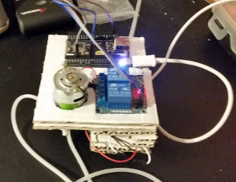
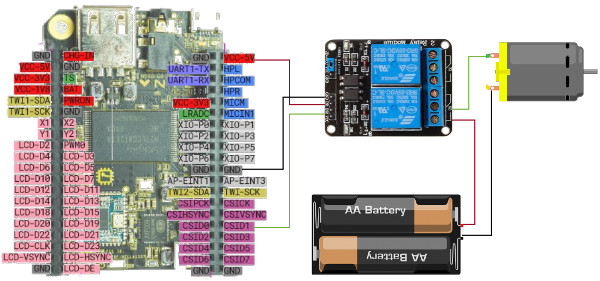

# C.H.I.P. Watering system

C.H.I.P. Watering system is a simple weekend project i've had in the back of my mind for a while.
its main goal is for it to  give **love** to the plants on a regular basis.

Hardware:
 - C.H.I.P. v1.0
 - Water pump (6v)
 - Dual relay module (One of the relays appeared to be burned)
 - Water tubes and junctions (3-4mm ø)
 - 4x AA battery compartment (to power the pump)
 - Plants in dire need of love
 - cardboard To build a layered box

Software:
 - Python (plus some libraries, CHIP_IO is proabably a hard requirement)

Wiring Diagram:

